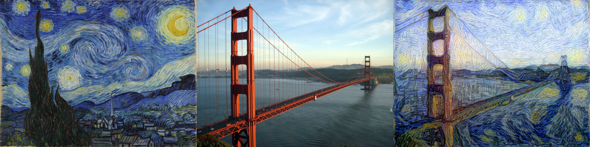

## Neural style transfer


*Style transfer applied to a picture of the Golden Gate bridge using on Vincent van Gogh's 'The Starry Night' artistic style. A result using Picasso's work can be found [here](etc/bridge_picasso.png).*

**py-style-transfer** implements image style transfer as proposed by [1,4,5] using PyTorch. Given an artistic image and a content image, the method iteratively generates an image that is similar to the content but drawn in the desired artistic style. While the method is not real-time capable, it is the most flexible approach, not requiring any style pre-training expect for a readily available pre-trained convolutional architecture such as VGG. While this implementation is based on [1,4,5] we also incorporate ideas from [2,3].

We also extend the approach to two more use-cases
 - **Seamless mode** generates tiles that can be stacked vertically/horizontally without visual seams.
 - **Tiled mode** allows generation of very large images that would otherwise not fit into memory. Like [this 8192x8192 10Mb/JPEG](https://drive.google.com/file/d/1modc1iGmTUx4LGbh-ZCTZsXxjujf-eHQ/view?usp=sharing) pure Picasso artistic style image.

See the interactive [StyleTransfer.ipynb](StyleTransfer.ipynb) notebook for usage and examples.

### Features
 - Various style losses such as gram-based, patch-based, semantic-based.
 - Capability to process on multiple scales.
 - Support for generating huge image sizes through tiling.
 - Support for generating images that stitch seamlessly.
 - Easily add new losses or modify the optimization through plugins.

### References

 [1] Gatys, Leon A., Alexander S. Ecker, and Matthias Bethge. "A neural algorithm of artistic style." arXiv preprint arXiv:1508.06576 (2015).</br>
 [2] Johnson, Justin, Alexandre Alahi, and Li Fei-Fei. "Perceptual losses for real-time style transfer and super-resolution." European Conference on Computer Vision. Springer, Cham, 2016.</br>
 [3] Gatys, Leon A., et al. "Controlling perceptual factors in neural style transfer." IEEE Conference on Computer Vision and Pattern Recognition (CVPR). 2017.</br>
 [4] Li, Chuan, and Michael Wand. "Combining markov random fields and convolutional neural networks for image synthesis." Proceedings of the IEEE Conference on Computer Vision and Pattern Recognition. 2016.</br>
 [5] Champandard, Alex J. "Semantic style transfer and turning two-bit doodles into fine artworks." arXiv preprint arXiv:1603.01768 (2016).</br>
 

### License

```
Copyright 2018 Christoph Heindl

Permission is hereby granted, free of charge, to any person obtaining a copy of this software and
associated documentation files (the "Software"), to deal in the Software without restriction,
including without limitation the rights to use, copy, modify, merge, publish, distribute, sublicense
and/or sell copies of the Software, and to permit persons to whom the Software is furnished to do so
subject to the following conditions:

The above copyright notice and this permission notice shall be included in all copies or substantial
portions of the Software.

THE SOFTWARE IS PROVIDED "AS IS", WITHOUT WARRANTY OF ANY KIND, EXPRESS OR IMPLIED, INCLUDING BUT
NOT LIMITED TO THE WARRANTIES OF MERCHANTABILITY, FITNESS FOR A PARTICULAR PURPOSE AND
NONINFRINGEMENT. IN NO EVENT SHALL THE AUTHORS OR COPYRIGHT HOLDERS BE LIABLE FOR ANY CLAIM, DAMAGES
OR OTHER LIABILITY, WHETHER IN AN ACTION OF CONTRACT, TORT OR OTHERWISE, ARISING FROM, OUT OF OR IN
CONNECTION WITH THE SOFTWARE OR THE USE OR OTHER DEALINGS IN THE SOFTWARE.
```